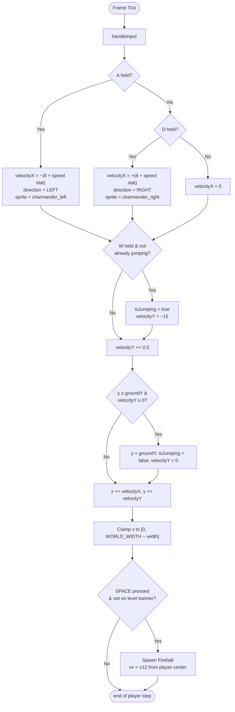

# Activity Diagram — Player Physics & Collisions

Detail that sits underneath [game_loop.md](game_loop.md)'s "Update all" and "Resolve collisions" boxes.

## Player input & physics (every frame, while not paused)

## Collision effects (checked every frame, in this order)

| # | Check | On hit |
|---|---|---|
| 1 | `ChaserEnemy` box ∩ house box | Explosion (36 particles) at chaser; chaser removed; `house.takeDamage(10)` |
| 2 | `BossSlime` box ∩ house box | Big explosion (80 particles); boss removed; `house.takeDamage(50)` |
| 3 | `MiniSlime` ∩ house box (house alive) | Explosion (18 particles); mini-slime removed; `house.takeDamage(15)` |
| 4 | `MiniSlime` ∩ player box | Explosion (12 particles); mini-slime removed; `lives--` → if `lives ≤ 0`: refill lives, replay current level (`spawnEnemies()`) |
| 5 | Player `Fireball` ∩ left/right house wall (house alive) | Fireball removed; `house.repair(10)` |
| 6 | `EnemyFireball` ∩ left/right house wall (house alive) | Fireball removed; `house.takeDamage(10)` |
| 7 | Player `Fireball` ∩ `Enemy` / `ChaserEnemy` / `BossSlime` | Fireball removed; target takes `damage` stat (×10 vs `BossSlime`); if target HP ≤ 0: removed, score `+50` (`+500` for `BossSlime`) |
| 8 | `EnemyFireball` ∩ player | Fireball removed; `lives--` → if `lives ≤ 0`: refill lives, replay current level (`spawnEnemies()`) |
| 9 | Player box ∩ any enemy box | Player teleported to world center; `score = max(0, score − 10)` — **no life lost** |

Notes:
- Checks 5–6 (wall heal/damage) and check 3 (mini-slime vs house) are skipped once `house.isDestroyed()` — the house just sits as rubble taking no further hits until the next `spawnEnemies()` call resets it to full HP.
- `BossSlime` triggers **rage mode** once its HP drops to ≤100: it stops normal ground-crawl spits and instead calls `spawnSkyRain()` (12–17 mini-slimes raining from random points above toward the house) every 5s, plus a one-time screen flash (`bossRageFlash`) and "!! ENRAGED !!" banner.
