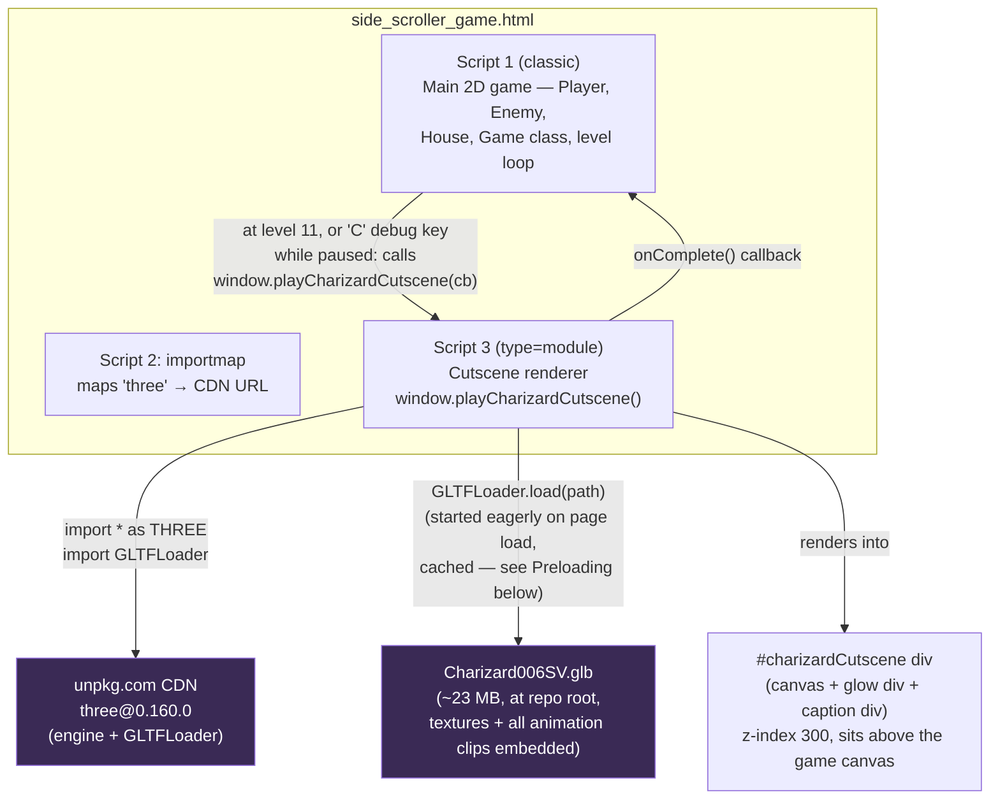

# Level 11 Charizard Cutscene

How the pre-level-11 Charizard cutscene fits into `side_scroller_game.html`. The whole feature lives in that one file, split across three `<script>` blocks, plus the `Charizard006SV.glb` asset at the repo root.

## Components & dependencies

**Why it needs `http://`/`https://` (not `file://`):** the module script's `import` statements and `GLTFLoader`'s internal `fetch()` for the `.glb` are blocked by CORS when the page is opened as a local `file://` path. Any static host (GitHub Pages, Netlify, itch.io, etc.) serves over `http(s)://` by default, so this only matters for local testing — use VS Code Live Server or `python -m http.server` instead of double-clicking the file.

## Preloading (why it exists)

The GLB is ~23 MB. Over a real connection that's several seconds to download, plus parse/shader-compile time — **~14 seconds total** measured in testing before anything visibly rendered. Originally the model was only fetched the moment the cutscene was first triggered, which made the very first cutscene (whenever a player first hit level 11, or hit the debug key) look completely frozen/broken for that whole window — a black-or-see-through overlay with nothing happening.

Fix: `loadCharizardScene()` is now called once, unconditionally, as soon as the module script runs (page load) — not just from inside `playCharizardCutscene()`. The fetch + parse happens in the background while the player plays through levels 1–10, so by the time level 11 actually arrives the model is already sitting in memory and the cutscene starts instantly. `playCharizardCutscene()` still `await`s the same cached promise, so triggering it (e.g. via the debug key) before the preload finishes just waits for the same in-flight load rather than starting a second one. If the preload fails, the cached promise is cleared so a later trigger retries instead of failing forever.

## Runtime flow (three phases, current timing)

```mermaid
sequenceDiagram
    participant GameLoop as "Game update cycle"
    participant State as gameState
    participant Cut as "playCharizardCutscene()"
    participant Three as "Three.js scene"

    GameLoop->>State: level 11 reached (or 'C' pressed while paused)
    GameLoop->>State: gameRunning = false, cutsceneActive = true
    GameLoop->>Cut: window.playCharizardCutscene(onComplete)
    Cut->>Three: show #charizardCutscene overlay
    Cut->>Three: model already preloaded (usually) - play rangeattack01, LoopRepeat
    Cut->>Three: flash glow in, fade out over 5s (independent of phases below)

    rect rgb(40,40,40)
    note over Cut,Three: Reveal phase - 0 to 2s
    Cut->>Three: background fades white to black
    Cut->>Three: camera holds close (0.3x radius), pans down from sky to model center
    end

    rect rgb(20,20,20)
    note over Cut,Three: Orbit phase - 2s to 8s
    Cut->>Three: camera rotates 0 to 180 degrees around the model
    Cut->>Three: camera radius eases back out to full distance
    end

    rect rgb(10,10,10)
    note over Cut,Three: Caption phase - 8s to 12s
    Cut->>Three: camera holds final framing
    Cut->>State: caption fades in - "Congratulations! Charmander evolved into Charizard!"
    end

    Cut->>State: hide overlay, clear caption
    Cut->>GameLoop: onComplete callback - resume game, spawn next level if triggered by level-up
```

## Current timing constants

| Constant | Value | Role |
|---|---|---|
| `REVEAL_DURATION_MS` | 2000 | White→black fade + camera pan down from sky, held at close zoom |
| `ORBIT_DURATION_MS` | 6000 | 180° orbit while zooming back out to normal distance |
| `CAPTION_DURATION_MS` | 4000 | Final hold + "Congratulations..." caption |
| `CUTSCENE_DURATION_MS` | 12000 (sum of the above) | Total cutscene length |
| `GLOW_DURATION_MS` | 5000 | Glow flash fade-out — independent of the reveal phase, runs on its own CSS transition |
| `CLOSE_RADIUS_FACTOR` | 0.3 | Camera starts at 30% of the normal orbit distance, then eases out during the orbit phase |

These live as `const` at the top of the module script — tune them there if the pacing needs to change again.

## Key files

| Path | Role |
|---|---|
| `side_scroller_game.html` | Everything — markup, CSS, game logic, cutscene logic |
| `Charizard006SV.glb` | 3D model + embedded textures + all animation clips (incl. `rangeattack01`), at the repo root (flat, not nested — GitHub Pages is case-sensitive and this path must match exactly) |

## Sizing note

The GLB is ~23 MB; the rest of the game (HTML, sprite PNGs) is under 1 MB. That's well within limits for GitHub Pages, Netlify, Vercel, etc. — no separate/external CDN hosting of the model itself is needed. The preloading strategy above (not a smaller file) is what actually fixes the perceived "not working" delay.
