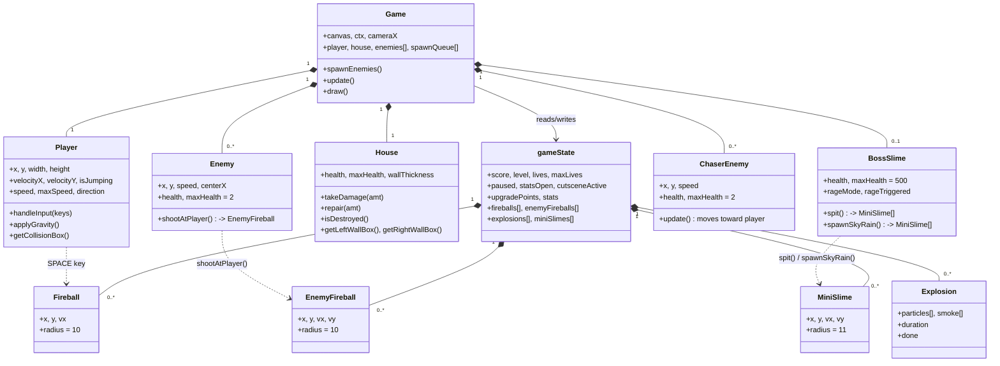

# Entity Diagram

Class relationships as they exist in `side_scroller_game.html` today. `gameState` is the single source of truth for run-time data that isn't owned by one specific object (score, level, lives, upgrade stats, and the shared projectile/effect arrays).

## Notes on inheritance

There is no shared base class — `Enemy`, `ChaserEnemy`, and `BossSlime` are independent classes that happen to share a duck-typed shape (`x`, `y`, `width`/`height` or radius-equivalent, `getCollisionBox()`, `update()`, `draw(ctx)`). The collision code in `Game.update()` checks `instanceof ChaserEnemy` / `instanceof BossSlime` directly rather than dispatching through a common interface — worth knowing if a fourth enemy type gets added later, since that `instanceof` chain (see [activity_diagram.md](activity_diagram.md)) would need a new branch too.

`Fireball`, `EnemyFireball`, and `MiniSlime` are similarly independent classes with near-identical shapes (position, velocity, radius, `active` flag, `getCollisionBox()`) rather than sharing a `Projectile` base.
