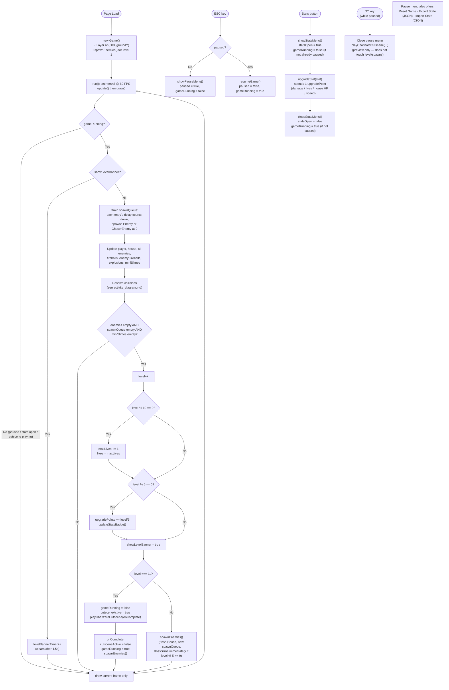

# Game Loop

The main loop as it stands today: level banners, spawn queues, a house to defend, a boss every 5 levels, upgrade points, and a one-time cutscene at level 11. Collision detail is broken out separately in [activity_diagram.md](activity_diagram.md).

## Notes

- **No real "Game Over"**: the `#gameOver` overlay exists in the markup/CSS but nothing in the code ever shows it. Running out of lives just resets `lives` to `maxLives` and calls `spawnEnemies()` again for the *same* level — the house also resets to full HP whenever `spawnEnemies()` runs. The house visually crumbles to rubble at 0 HP but that doesn't end the level or the game; it just looks damaged until the next level starts. This is effectively an endless mode.
- **Save/Load**: Export/Import (in the pause menu) round-trip `score`, `level`, `lives`, `maxLives`, `upgradePoints`, `stats`, player position/direction, and house health as JSON — everything else (enemies, projectiles, spawn queue) is regenerated fresh via `spawnEnemies()`.
