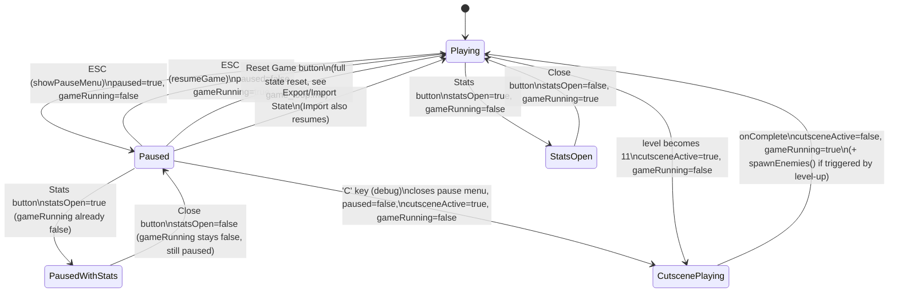

# UI / App State

`gameState.gameRunning` gates the entire `Game.update()` step (see [game_loop.md](game_loop.md)); `draw()` always runs regardless, which is what lets menus and the cutscene overlay render on top of a frozen last frame.

Three independent-ish flags control this: `paused`, `statsOpen`, `cutsceneActive`. They're each set by their own show/close functions rather than derived from one another — see the **Known quirk** below.

## Known quirk: `PausedWithStats → Playing` via ESC

`resumeGame()` unconditionally sets `paused = false` and `gameRunning = true` and hides the pause menu — it does **not** check or close the stats menu. So the sequence ESC (pause) → open Stats → ESC (resume) leaves the Stats overlay visually on screen (`statsOpen` still `true`, `#statsMenu` still `display:block`) while the game underneath starts running again. Not currently guarded against; worth knowing if this ever gets reported as "the game moves behind the stats screen."

## Debug cutscene trigger

Pressing `C` while `paused` is true (pause menu open) calls `window.playCharizardCutscene()` directly, bypassing level logic entirely — it's a preview tool, not tied to `gameState.level`. See [charizard_cutscene.md](charizard_cutscene.md).
